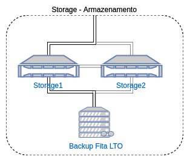

# _Storage_/Armazenamendo FreeNAS

Neste repositório é descrita a forma atual de armazenamento persistente em implementação no [IFSC câmpus São José](http://sj.ifsc.edu.br). Foi adotada a solução [FreeNAS](http://www.freenas.org/) após várias pesquisas e testes. A escolha dessa solução e desse formato centralizado dos arquivos em um _storage_ se deu pela facilidade de manutenção, velocidade e estabilidade oferecidas por essa ferramenta.

## A estrutura adorada é a seguinte:


Utilizaremos como _storage_ servidores com a seguinte especificações de Hardware:

* 2 x HP ProLiant 360 G6: 
  * 1 x Intel(R) Xeon(R) CPU E5504 @ 2.00GHz
  * 4 x 8 GB = 32GB de RAM
  * 2 x Broadcom NetXtreme II BCM5709 Gigabit Ethernet em agregação de enlace com [LACP](https://standards.ieee.org/findstds/standard/802.1AX-2008.html)
  * 4 x HD SAS 10k 600 GB (totalizando 1.1TB em RAIDZ2 com [ZFS](http://www.freenas.org/zfs/))

## Testes de possíveis defeitos nos discos do FreeNAS:

Após a implementação e configuração do FreeNAS, com base na [documentação oficial](http://doc.freenas.org/), foram realizados alguns testes :

* Com o sistema operando, foram retirados dois discos aleatoriamente: continuou funcionando normalmente.
* Inversão da posição física de dois discos: o sistema reconheceu e sincronizou automaticamente os discos.
* Retirada de um terceiro  disco (diferente dos dois anteriores) e colocado outro disco novo no lugar: o sistema reconheceu que foi substituído o disco e deixou disponível a opção de agregar o disco ao RAIDZ2, onde após a confirmação da operação o sistema iniciou a sincronização dos blocos.

Em todos os casos, os testes apresentaram resultados satisfatórios de disponibilidade e velocidade de leitura e escrita.
    
## Testes de desempenho de escrita de dados no FreeNAS

Foi configurado um compartilhamento NFS para [testes remotos de leitura e escrita](https://serenity-networks.com/simple-method-to-benchmark-read-write-speeds-from-the-linux-command-line/) em rede.

### Velocidade de leitura em NFS
```sh
dd if=tempfile of=/dev/null bs=1M count=1024
1024+0 registros de entrada
1024+0 registros de saída
1073741824 bytes (1,1 GB) copiados, 9,19565 s, 117 MB/s
```

### Velocidade de escrita em NFS

```sh
sync; dd if=/dev/zero of=tempfile bs=1M count=1024; sync
1024+0 registros de entrada
1024+0 registros de saída
1073741824 bytes (1,1 GB) copiados, 9,82436 s, 109 MB/s
```

Em ambos os casos, o teste se aproximou do limite teórico do enlace.

